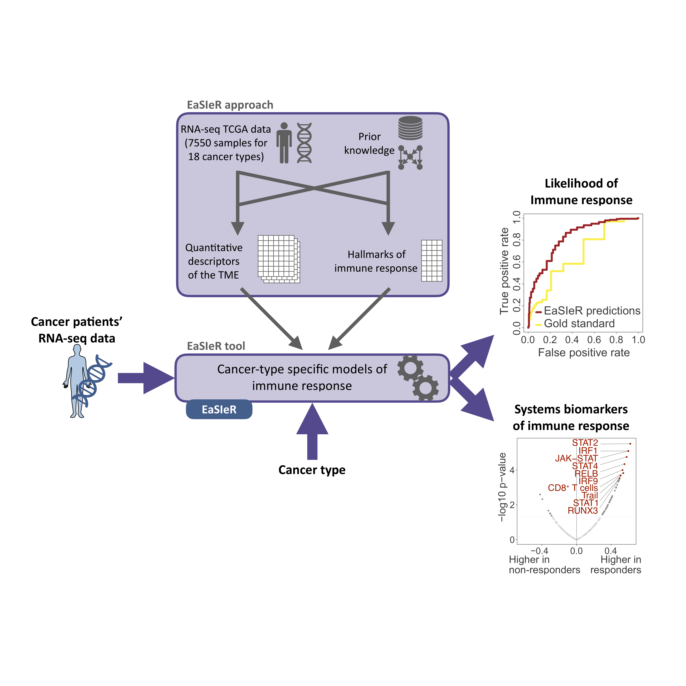

# easier

---
 
<!-- badges: start -->
[](https://github.com/olapuentesantana/easier_devel/actions)
<!-- badges: end -->

## DESCRIPTION

The goal of `easier` is to contextualize the prediction of anti-tumor immune responses from RNA-seq data using EaSIeR. 

EaSIeR is a tool to predict biomarker-based immunotherapy based on cancer-specific models of immune response. Model biomarkers have been experimentally validated in the literature and the performance of EaSIeR predictions has been validated using independent datasets from four different cancer types with patients treated with anti-PD1 or anti-PD-L1 therapy.

These models are available through `easierData` package and can be accessed using `get_opt_models()`.

Please see [(Lapuente-Santana O et al., Patterns, 2021](https://doi.org/10.1016/j.patter.2021.100293) for additional details on EaSIeR.



## INSTALLATION

You can install the development version of `easier` from GitHub with:

``` r
library("remotes")
remotes::install_github("olapuentesantana/easier", 
                        dependencies = TRUE, build_vignettes = TRUE)
```
## EXAMPLE

A more detailed pipeline is available in the vignette:
``` r
vignette("easier_user_manual", package = "easier")
```
## CITATION

If you use this package in your work, please cite the original EaSIeR study:

Lapuente-Santana, Oscar, Maisa van Genderen, Peter A. J. Hilbers, Francesca Finotello, and Federica Eduati. 2021. “Interpretable Systems Biomarkers Predict Response to Immune-Checkpoint Inhibitors.” Patterns, 100293. https://doi.org/10.1016/j.patter.2021.100293.
